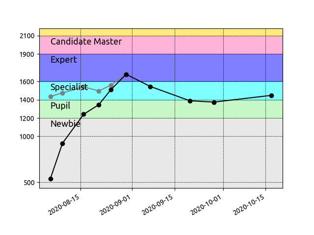

# Codeforces

Transcription of my submissions for the Codeforces contests: [https://codeforces.com](https://codeforces.com)

Handle: 

All participations done in Rust.

1.  [Codeforces Round #661 (Div. 3)](https://codeforces.com/contest/1399) as  

2.  [Codeforces Round #663 (Div. 2)](https://codeforces.com/contest/1391) as  

3.  [Global Codeforces Round 10](https://codeforces.com/contest/1392) as  

4.  [Codeforces Round #665 (Div. 2)](https://codeforces.com/contest/1401) as  

5.  [Educational Codeforces Round 94 (Div. 2)](https://codeforces.com/contest/1400) as  

6.  [Codeforces Round #666 (Div. 2)](https://codeforces.com/contest/1397) as  

